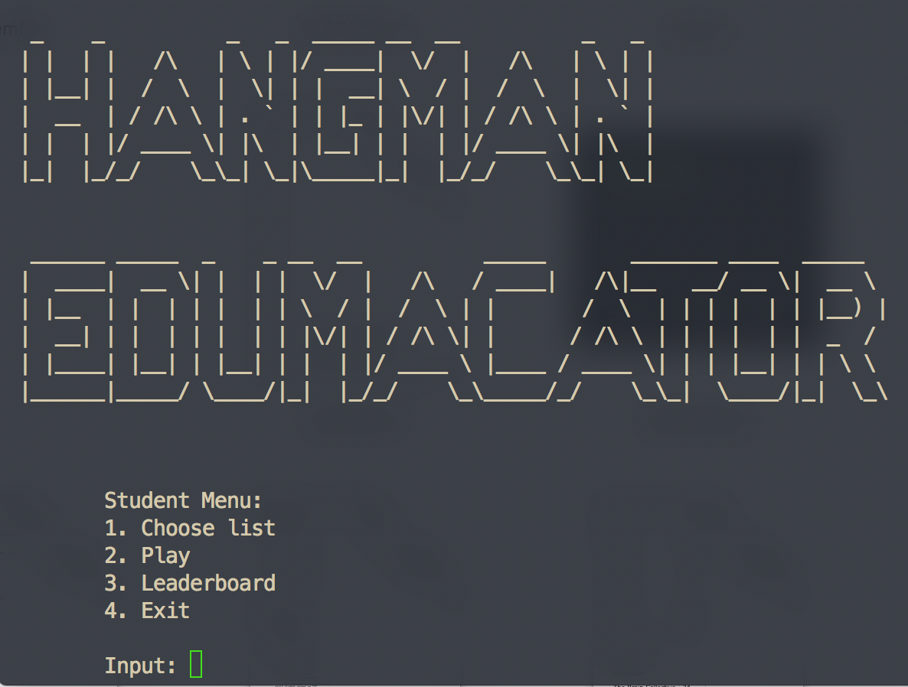

 # Educational Hangman
 
Educational Hangman is a great tool/game for teachers and primary-aged students to get comfortable with a terminal while learning and practicing new words they learn using the classical Hangman game.

Students can track their progress and compete against one another with a scoreboard that tracks and saves their scores.

Teachers can create or add new word lists to the game and monitor the progress of students.


## Getting Started
1. Download and unzip folder to your Desktop
2. Open Terminal and input:
```sh
cd Desktop/hangman_edumacator-master.zip
```
4. Install bundler
    * For MAC: Enter "gem install bundler" into Terminal
    * For WINDOWS: Enter "sudo apt install ruby-bundler" into Terminal
5. Once bundler installed, Enter "bundle install" into Terminal
6. To run the game, Enter "ruby main.rb"

## Prerequisites
- Ruby 2.4.1
- Terminal / BASH

## Program Modes 
### 1. Students
Functions:
1. Choose category to play (work in progress)
2. Play Hangman
3. View scoreboard
### 2. Teacher
Functions:
1. Create new category (work in progress)
2. Play Hangman
3. View scoreboard (to add: graph function for progress) 

## Gems
 - Terminal-Table
 - Artii

## Features to be added
1. Ability for teacher to import or create a new category word list
2. Graphing function on scoreboard for student scores
3. Difficulty levels
    * Ability to specify starting letter in word list to narrow down words to be tested
    * Ability for user to tweak the number of tries and rounds of Hangman to play

## Main Components:

### main.rb
Contains functions for the Hangman core game

user_guess_letter:
    
    Compares user's character input (guess) against the random word (randomized_word_array) and fills in a displayed blank array (display_word_array) in the corresponding position of the characters.
    It also returns attempted guesses into a displayed array (tried_chars) and reduces the number of tries per attempt.
hangman_game:

    This is the main interface of the game that sets the number of rounds and tries for the player.
    The randomized word array and display array are created here.
    The win condition is met when the guessed chars set in (display_word_array) match (randomized_word_array).
    At the moment, it is set to play over 5 rounds, with 6 attempts given per round.
### mainmenu.rb
Contains functions for all the menus.

Menus are nested into one another, allowing the app to be exited from the highest level menu.
### word_list.rb
Contains array for word list.
Functions to select a word from the entire list or from a specified first letter exist here, though the latter has not been implemented into the main app.
### scoreboard.rb
Reads and write from/to local file 'scoreboard.csv' utilising the array (high_scores_array)
Also incorporates print_as_table function to print the array of scores into a neat table.
## Challenges
**Maurice:** The overall challenge I faced with the terminal app challenge was organising thought into action. I learnt very quickly that launching into coding, while it got things moving quickly, would land me in moments without clear direction. This was helped greatly by my partner Erin, together with whom we continued to plan the features we could implement and the direction of our project.

I also learnt a lot about self-referencing methods and techniques in Ruby that I hadn’t previously learnt or been taught. The biggest thing I’ve realised I need to improve on is writing cleaner, more organised code!


**Erin:** For me, the big challenges have been syntax and structure. While having a clear grasp on which methods perform which action - I felt I got stuck getting started and fitting everything together. 

 Maurice has been great at providing advice and mapping out which functions to use and where. I felt my coding ability improve greatly with this challenge, and I'm sure my syntax and structure struggles will soon be behind me.
## Authors
Maurice Yong && Erin Belot
## Contributors
Matt, Gretch, and Reugan -  A big thank you for your debugging advice, guidance, and moral support.